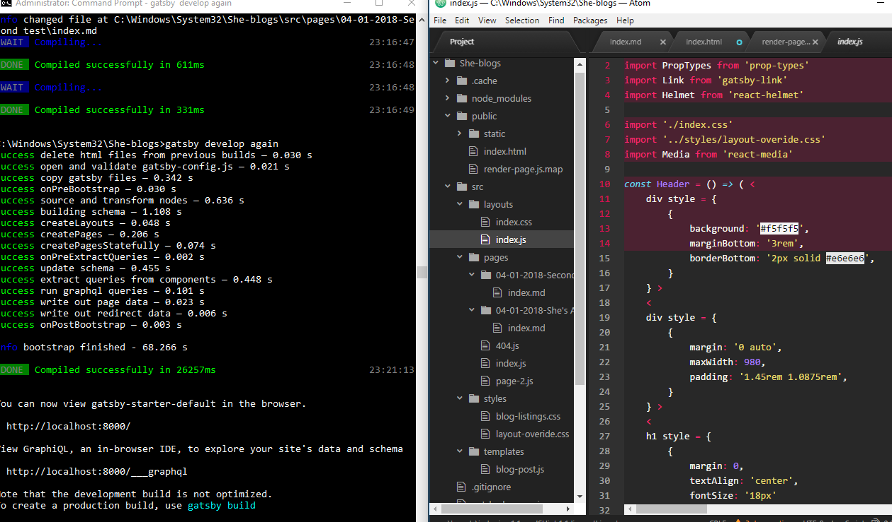
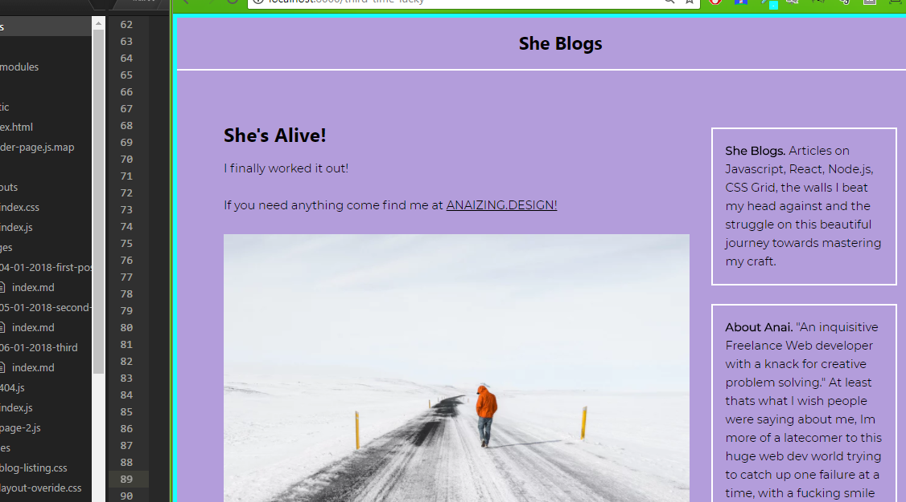
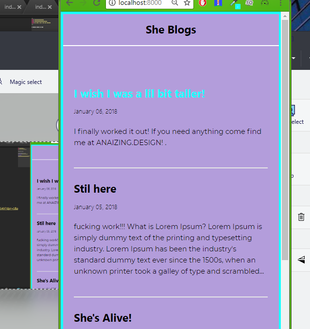
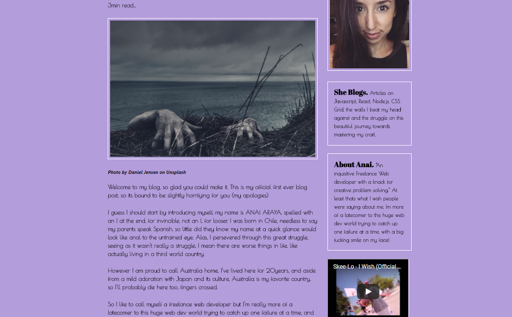
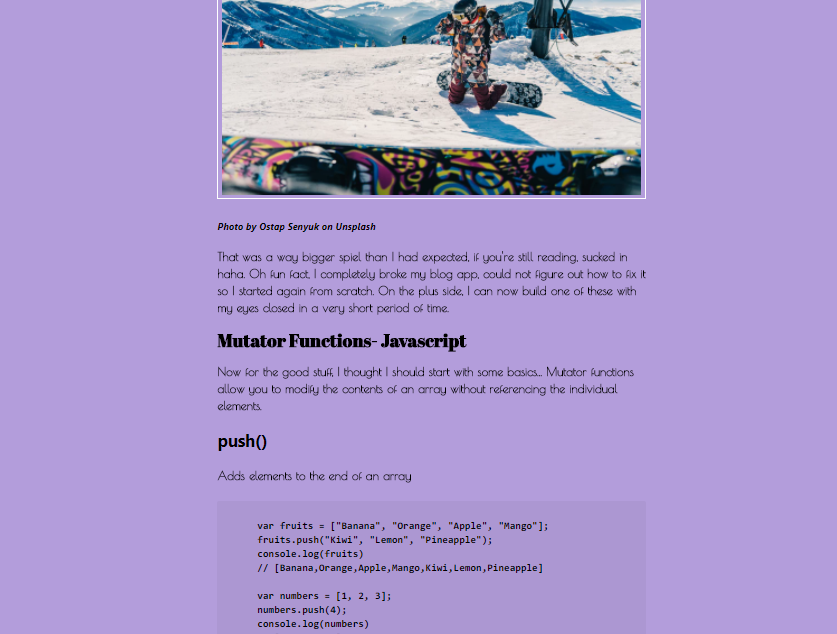

# 100 Days Of Code - Log

### Day 0: January 03, 2018 

**Today's Progress**: Formulated a plan for what I will get out of this challenge

**Thoughts:** Ive separated my plan into three main areas; 

1. My blog- i not only need to build this but i aim to document my progress daily, and it will be the focus for my personal study on top of what i will learn as i work on the other two areas. 

2. My Progressive Web App- This is my passion project, i've wanted to learn more about PWA's and how to build them from scratch for about a year now and I have an idea for a project that has not yet been done in Australia. I think this will be a really tough but fun project. 

3. My Portfolio, I plan on building a fun/creative/interactive portfolio that showcases my outgoing personality as well as my skill set (that I aim to aquire by the end of this).

There are also... 

Various toutorials I will complete and document throughout the 100 days, (eg the Kyle S/FrontEndMasters collection)

books I will read and 

languages/frameworks I will learn to use (React, Node, Redux)

**Link to work:** [My website, anaizing.design](https://anaizing.design)

### Day 1: January 04, 2018 

**Today's Progress**: Built my first react/graphQL app with a sprinkle of Gatsby to get it all up and running fairly quickly. A responsive Blog app.
Needs a bit of love in the design side still, but Im pretty happy with its functionality.
Not bad for day 1

**Thoughts:** Needs a bit of love in the design side still, but Im pretty happy with its functionality. I ran into a bit of trouble with npm so i switched to yarn and that worked a treat. 

Not bad for day 1

### Day 2: January 05, 2018 

**Today's Progress**: Broke the app I made yesterday, couldnt fix it, started it again from scratch... aka no real progress.

**Thoughts:** Must learn react properly so i can fix bugs

### Day 3: January 06, 2018 

**Today's Progress**: Fixed the css on my blog app, added a couple of entries to the md files, found a really nice nav svg to put on my app still havent figuered out how to get it on there

**Thoughts:** its amazing how many libraries and code goes into such a basic app. At least it works as expected.

### Day 4: January 07, 2018 

**Today's Progress**: Worked on my blog posts, and on iterator functions and on mutator functions

**Thoughts:** daily blogging is very time consuming but my blog app is looking Niiiiice. Think i should build a flip card app to study.

